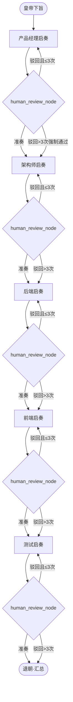
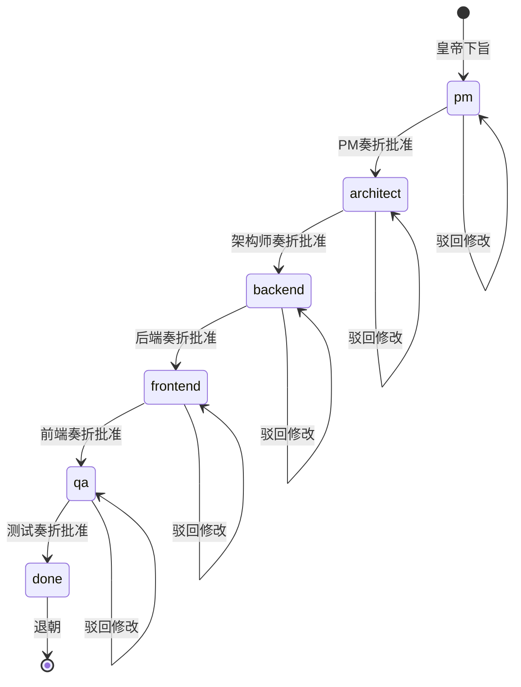

# 🏯 ProductKingdom —— 皇帝上朝式多 Agent 协作产品开发系统

基于 **LangGraph** 构建的多智能体协作系统，模拟"皇帝上朝"场景：用户扮演皇帝，五位 AI 大臣依次启奏产品文档，皇帝逐一审批或驳回，直到所有奏折通过。项目同时提供 CLI 与宫廷风 Web 页面。

## ✨ 特性

- 🎭 **角色扮演**：五位大臣（PM、架构师、后端、前端、测试）各有专长
- 📜 **结构化产出**：每位大臣输出标准化的产品文档
- 👑 **Human-in-the-Loop**：皇帝拥有最终决定权，可批准或驳回
- 🔄 **迭代修改**：驳回后大臣根据朱批修改，最多强制通过次数可配置
- 🧠 **上下文共享**：后序大臣可参考前序已批准的奏折
- 💾 **状态持久化**：基于 LangGraph 的 checkpointer 机制
- 🖥️ **Web 朝堂**：宫廷卷轴风格前端，支持下旨、批阅、驳回和退朝汇总

## 🏗️ 系统架构

### 核心流程



### 状态流转



### 共享状态 (KingdomState)

| 字段 | 类型 | 说明 |
|------|------|------|
| `requirement` | `str` | 皇帝最初的产品需求 |
| `stage` | `str` | 当前阶段：pm / architect / backend / frontend / qa / done |
| `outputs` | `dict[str, str]` | 已批准的奏折（key=阶段名, value=内容） |
| `current_draft` | `str` | 当前大臣的草案（待审批） |
| `feedback` | `str` | 皇帝的朱批意见 |
| `approval` | `bool` | 当前草案是否被批准 |
| `revision_count` | `dict[str, int]` | 各阶段被驳回的次数 |

## 📁 项目结构

```
ProductKingdom/
├── agents/                    # 各位大臣的提示词与生成逻辑
│   ├── __init__.py
│   ├── pm.py                 # 产品经理
│   ├── architect.py          # 架构师
│   ├── backend.py            # 后端开发
│   ├── frontend.py           # 前端开发
│   └── qa.py                 # 测试工程师
├── graph/                     # LangGraph 定义
│   ├── __init__.py
│   ├── state.py              # KingdomState 状态定义
│   ├── nodes.py              # 所有节点函数（工作节点 + 审批节点）
│   ├── routing.py            # 条件路由函数
│   └── workflow.py           # 图的构建与编译
├── utils/
│   ├── __init__.py
│   ├── context.py            # 前序奏折上下文整理与截断
│   └── llm.py                # LLM 实例创建
├── web/
│   ├── static/               # 前端 CSS / JS / 图像素材
│   └── templates/            # Flask 页面模板
├── main.py                    # CLI 入口，运行交互循环
├── web_app.py                 # Web 入口，运行宫廷风页面
├── config.py                  # 配置项
├── start.bat                  # Windows 一键启动脚本
├── requirements.txt           # Python 依赖
├── .env.example               # 环境变量模板
└── README.md                  # 本文件
```

## 🚀 快速开始

### 1. 一键启动（推荐）

双击项目根目录下的：

```bat
start.bat
```

脚本会自动创建 `.venv`、安装依赖、启动 Web 服务，并打开：

```text
http://127.0.0.1:7860
```

### 2. 手动安装依赖

```bash
cd ProductKingdom
pip install -r requirements.txt
```

### 3. 配置环境变量

```bash
cp .env.example .env
# 编辑 .env，填入你的 DeepSeek API Key
```

### 4. 运行 Web 页面

```bash
python web_app.py
```

### 5. 运行 CLI

```bash
python main.py
```

### 4. 交互示例

```
👑 请陛下下旨（输入您的产品需求）：
> 我想开发一个在线协作文档编辑系统

⏳ 大臣们正在准备启奏...

============================================================
📜 产品经理 启奏：
============================================================
## 一、背景与目标
...
============================================================

👑 陛下朱批（'y'/'准奏'=批准，其他=修改意见）：
> 准奏

⏳ 正在传达圣意...

============================================================
📜 架构师 启奏：
============================================================
...
```

## ⚙️ 配置说明

在 `.env` 文件中可配置以下参数：

| 参数 | 默认值 | 说明 |
|------|--------|------|
| `OPENAI_API_KEY` | (必填) | DeepSeek API Key |
| `MODEL_NAME` | `deepseek-v4-flash` | LLM 模型名称 |
| `OPENAI_API_BASE` | `https://api.deepseek.com` | OpenAI 兼容 API 端点 |
| `MAX_TOKENS` | `2048` | LLM 最大输出 token 数 |
| `TEMPERATURE` | `0.7` | LLM 温度参数 |
| `MAX_REVISIONS` | `3` | 最大驳回次数，超过则强制通过 |
| `CONTEXT_CHAR_LIMIT` | `2000` | 单份前序奏折注入 prompt 的最大字符数 |

### 使用其他 LLM 服务

```bash
# DeepSeek
OPENAI_API_BASE=https://api.deepseek.com/v1
MODEL_NAME=deepseek-v4-flash

# Ollama (本地)
OPENAI_API_BASE=http://localhost:11434/v1
MODEL_NAME=llama3
OPENAI_API_KEY=ollama
```

## 🔍 LangSmith 追踪

在 `.env` 中配置以下变量即可自动启用全链路追踪：

```bash
LANGCHAIN_TRACING_V2=true
LANGCHAIN_API_KEY=lsv2_pt_your_langsmith_api_key_here
LANGCHAIN_PROJECT=ProductKingdom
```

启用后，每一次 LLM 调用和 LangGraph 状态流转都会自动上报到 LangSmith 平台，可以查看：
- 🗺️ **Graph Trace** — 完整的图执行路径、节点耗时、状态快照
- 🤖 **LLM Call** — 每次大臣调用的 prompt/response、token 消耗、延迟
- 🔁 **Human-in-the-Loop** — interrupt/resume 的完整链路

> LangChain 在检测到 `LANGCHAIN_TRACING_V2=true` 时会自动启用追踪，无需额外代码。

## 📋 各大臣产出说明

| 大臣 | 产出内容 | 必含章节 |
|------|----------|----------|
| 产品经理 | PRD / 用户故事 | 背景与目标、用户故事、功能列表、非功能需求、验收标准 |
| 架构师 | 系统架构设计 | 技术选型、模块划分、数据流图、接口概要、部署架构、风险与权衡 |
| 后端开发 | 接口与数据模型 | 数据模型、API 详细设计、核心逻辑、数据库设计、错误处理 |
| 前端开发 | 页面与组件设计 | 页面结构、组件树、状态管理、前后端交互、路由设计、UI/UX |
| 测试工程师 | 测试方案 | 测试策略、环境、用例、边界测试、验收标准、回归方案 |

## 🔧 技术栈

- **Python** 3.11+
- **LangGraph** >= 0.2.0（状态图、中断机制、条件路由）
- **LangChain** + **langchain-openai**（LLM 调用）
- **TypedDict**（共享状态结构定义）
- **Pydantic** >= 2.0（依赖预留，便于后续增强校验）
- **Flask** >= 3.0（Web 页面与 API）
- **python-dotenv**（环境变量管理）
- **LangSmith**（可选，LLM 调用与图执行全链路追踪）

## 📄 License

MIT
